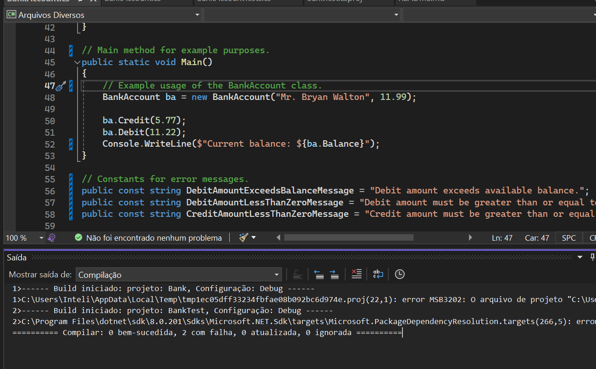
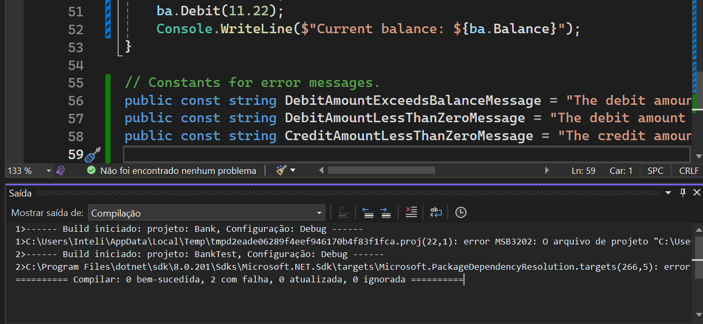

# Relatório do Tutorial de Testes de Unidade em C# com Visual Studio

## Introdução
Este relatório descreve o processo de implementação e execução de testes de unidade em um projeto C# utilizando o Visual Studio.

## Tecnologia e Conceitos
- **Tecnologia:** Visual Studio, C#
- **Conceitos Aprendidos:**
  - Estrutura de projetos e testes no Visual Studio.
  - Criação de classes de teste e métodos de teste.
  - Utilização de asserts para verificar resultados esperados.
  - Processo iterativo de análise, desenvolvimento de testes e refatoração.

## Passo a Passo
1. **Criação do Projeto "Bank" e Implementação da Classe `BankAccount`**
   - Código disponível em `Projeto-Bank/Bank/BankAccount.cs`.

2. **Criação do Projeto de Teste "BankTests" e Adição de Referência**
   - Código disponível em `Projeto-Bank/BankTests/BankAccountTests.cs`.

3. **Execução dos Testes e Identificação de Erros**
   - ... (Executar os testes no Visual Studio).

4. **Correção de Erros e Nova Execução dos Testes**
   - ... (Corrigir o código e executar os testes novamente).

## Print de Código em Execução

#### Resultados dos Testes no Visual Studio DO BankAccounts

 

#### Resultados dos Testes no Visual Studio do BankTests

 
